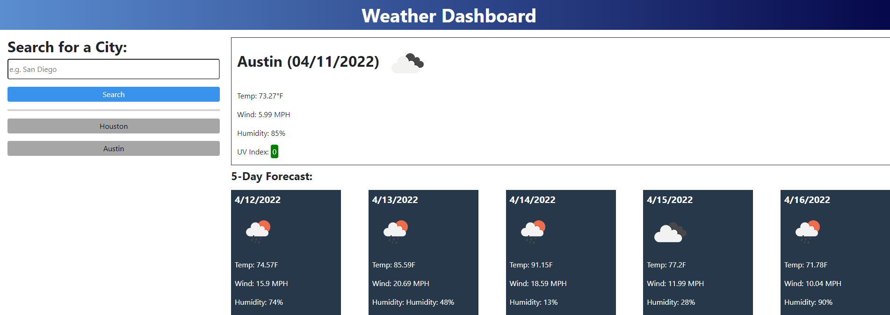
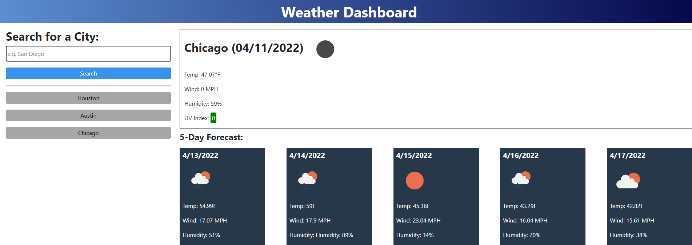

# 06-weather-dashboard

The objective of this challenge was to create a weather dashboard that displays the current and future weather for a searched city. I not was provided started code and wrote the appliction code to the best of my knowledge, applying teachings learned in the modules leading up to and including module 6. The acceptance criteria are as follows:

## Acceptance Criteria

```
GIVEN a weather dashboard with form inputs
WHEN I search for a city
THEN I am presented with current and future conditions for that city and that city is added to the search history
WHEN I view current weather conditions for that city
THEN I am presented with the city name, the date, an icon representation of weather conditions, the temperature, the humidity, the wind speed, and the UV index
WHEN I view the UV index
THEN I am presented with a color that indicates whether the conditions are favorable, moderate, or severe
WHEN I view future weather conditions for that city
THEN I am presented with a 5-day forecast that displays the date, an icon representation of weather conditions, the temperature, the wind speed, and the humidity
WHEN I click on a city in the search history
THEN I am again presented with current and future conditions for that city
```

## The following screenshots demonstrate the application functionality:

Displayed city current weather and next 5-day forecast:



Different city to demo functionality:



## Deployed App

[GH Pages](https://realnifty.github.io/06-weather-dashboard/)